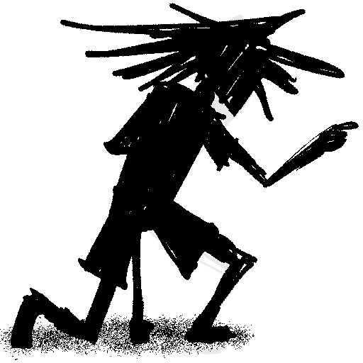

--- 
tags: note
layout: post.njk 
title: Eva - "Mr. Money"
---

Ran my solo party through an encounter with a Solo monster. One of my two full-fledged PCs is named Cash and is a hard-boiled type, so obviously he needs a nemesis and what better name than "Money?" I rolled some dice and did some thinking and decided that Money was a Mr. Money and is a flamboyantly chaotic oil surveyor.

Mister Money.

Needless to say, Mr. Money and his poor goons got their shit beat in. My fighter, Noah, dishes out a lot of punishment every round, and I probably didn't give Mr. Money enough grunts to back him up. I think in a longer adventuring day it'd work out, though.

Mr. Money surrendered after Cash made a high enough intimidate check (because that's a thing in 4E I guess), so Cash and company have a moderately lucrative hostage; but more likely they'll dump him on the provisional militia where he'll escape easily. Classic stuff.